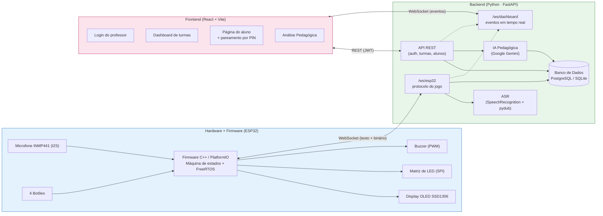
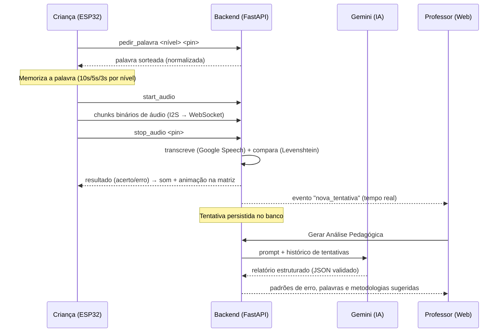
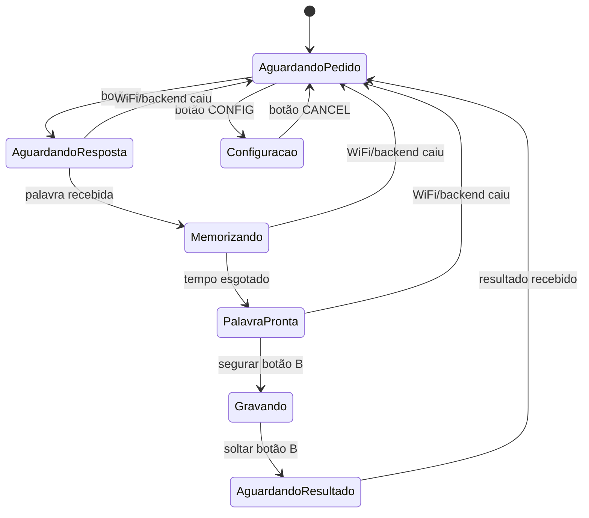

# Soletrando e Aprendendo

[]()

Jogo educativo de **soletração por voz**, construído com um dispositivo físico baseado em **ESP32**, um backend em **Python (FastAPI)** com reconhecimento de fala e um agente de **IA pedagógica (Google Gemini)**, e um painel web em **React** para professores acompanharem o desempenho de seus alunos em tempo real.

A criança memoriza uma palavra mostrada em um display OLED, depois soletra falando as letras em voz alta perto de um microfone. O sistema transcreve a fala, avalia a resposta com tolerância a pequenos erros de reconhecimento, dá feedback sonoro/visual imediato (matriz de LED + buzzer) e registra tudo no backend que, sob demanda, gera um **relatório pedagógico com IA**, identificando padrões de erro fonético/ortográfico e sugerindo palavras e metodologias de reforço para cada aluno ou turma.

> Para uma análise técnica aprofundada de cada funcionalidade (como cada módulo funciona, decisões de arquitetura, fluxogramas detalhados e problemas de engenharia resolvidos) veja o **Relatório Técnico Detalhado** (`relatorio_tecnico.docx`).

---

## Principais funcionalidades

- 🎮 **Jogo de soletração com 3 níveis de dificuldade**, progressão cíclica (acerta → sobe de nível; erra → volta ao nível 1) e tempo de memorização decrescente por nível.
- 🎙️ **Captura de áudio em tempo real** via microfone I2S (INMP441), processada em paralelo ao restante do firmware usando FreeRTOS (dual-core).
- 🗣️ **Reconhecimento de fala em português** (Google Speech Recognition), com pré-processamento de áudio (normalização de volume, remoção de silêncio) e comparação tolerante a erro via distância de Levenshtein.
- 🧠 **Análise pedagógica com IA generativa (Gemini)**: identifica padrões de erro fonético/ortográfico recorrentes, sugere palavras de reforço e metodologias de ensino, com cache inteligente para economizar chamadas à API.
- 📶 **Portal de configuração de WiFi** embarcado no próprio dispositivo (Access Point + página web), sem necessidade de recompilar o firmware para trocar de rede.
- 🔐 **PIN de pareamento**: vincula um dispositivo físico a um aluno específico, sem exigir login no ESP32.
- 📊 **Painel web para professores**: turmas, alunos, histórico de tentativas, áudios gravados e relatórios de IA — tudo atualizado **em tempo real** via WebSocket.
- 💡 **Feedback sensorial completo**: display OLED, matriz de LED (animações de acerto/erro) e buzzer com melodias e efeitos configuráveis.

---

## Arquitetura em alto nível

O sistema é dividido em três camadas, comunicando-se majoritariamente por **WebSocket** (tempo real) e **REST/JWT** (operações administrativas do professor):



---

## Fluxo de uma rodada de jogo



---

## Máquina de estados do firmware



---

## Stack de tecnologias

| Camada | Tecnologias |
|---|---|
| **Hardware** | ESP32 (dual-core), microfone digital INMP441 (I2S), display OLED SSD1306 (I2C), matriz de LED MAX72xx (SPI), buzzer passivo (PWM) |
| **Firmware** | C++ (Arduino framework), PlatformIO, FreeRTOS (tasks + queues), WebSocketsClient, Adafruit SSD1306, MD_Parola, LittleFS, Preferences (NVS) |
| **Backend** | Python, FastAPI, Uvicorn, SQLModel (SQLAlchemy + Pydantic), PostgreSQL/SQLite, python-jose (JWT), passlib/bcrypt, SpeechRecognition, pydub, **google-genai (Gemini)** |
| **Frontend** | React 19, Vite, React Router DOM, Tailwind CSS 4, Recharts, lucide-react, WebSocket API |
| **Protocolos** | WebSocket (jogo em tempo real e dashboard), REST + JWT (administração), I2S (áudio), SPI/I2C (periféricos) |

---

## Estrutura do repositório

```
FW_Soletrando_e_Aprendendo/
├── src/                    # Firmware ESP32 (C++)
│   ├── main.cpp             # Máquina de estados, captura de áudio, WebSocket
│   └── modules/
│       ├── buzzer/           # Sons e melodias (PWM)
│       ├── matrix/           # Matriz de LED (animações, contador, scroll)
│       ├── oled/              # Display OLED (telas do jogo e do menu)
│       ├── menu/              # Menu de configurações
│       └── wifi_config/      # Portal de configuração de WiFi (AP + página web)
├── data/                    # Página HTML do portal WiFi (servida via LittleFS)
├── python/                  # Backend FastAPI
│   ├── main.py                # Ponto de entrada da API
│   ├── websocket_esp32.py    # Protocolo de jogo em tempo real com o ESP32
│   ├── dashboard_ws.py        # WebSocket de eventos para o painel do professor
│   ├── asr.py                  # Reconhecimento de fala e normalização de texto
│   ├── ia_pedagogica.py       # Integração com o Google Gemini
│   ├── auth.py                 # Autenticação JWT
│   ├── database.py, models.py, schemas.py
│   └── routers/                # Rotas REST (auth, turmas, alunos, relatório de IA)
├── database/                 # schema.sql + listas de palavras por nível
├── frontend/                 # Aplicação React (dashboard do professor)
├── platformio.ini            # Configuração de build do firmware
└── sch_pci.pdf               # Esquemático elétrico / PCB
```

---

## Como rodar o projeto

### 1. Firmware (ESP32)
```bash
# Requer PlatformIO (extensão do VS Code ou CLI)
pio run --target upload      # grava o firmware no ESP32
pio run --target uploadfs    # envia data/index.html para o LittleFS
```
Na primeira inicialização, conecte-se à rede WiFi `ESP32-Config` (senha `config1234`) e acesse `http://192.168.4.1` para configurar a rede WiFi real do dispositivo.

### 2. Backend (Python)
```bash
cd python
pip install -r requirements.txt
# Crie um arquivo .env na raiz do projeto com:
#   DB_URL=sqlite:///./soletrando.db
#   JWT_SECRET=uma-chave-segura
#   GEMINI_API_KEY=sua-chave-da-api-gemini
#   GEMINI_MODEL=gemini-3.5-flash (ou outro modelo disponível)
python3 -m uvicorn main:app --host 0.0.0.0 --port 8080 --reload
```

### 3. Frontend (React)
```bash
cd frontend
npm install
npm run dev
```

---

## Diferencial: Análise Pedagógica com IA

Após um número mínimo de tentativas registradas, o professor pode gerar (a qualquer momento, pelo painel web) uma análise pedagógica automática (individual ou de toda a turma). O backend monta um prompt com a persona de um *"psicopedagogo especialista em alfabetização infantil e fonoaudiologia"*, envia o histórico de tentativas ao Gemini e recebe de volta uma **saída estruturada e validada por schema** (não texto livre), contendo:

- 📈 Resumo de desempenho (acertos, erros, taxa de acerto)
- 🔍 Padrões de erro fonético/ortográfico recorrentes, com exemplos reais
- 📝 Palavras recomendadas para reforço, com justificativa pedagógica
- 🎯 Metodologias de ensino sugeridas, com orientação prática de aplicação

O relatório é **cacheado no banco de dados** e só é regenerado quando novas tentativas são registradas, economizando tempo e cota de uso da API.

---

## Documentação adicional

Para uma explicação completa de cada funcionalidade (incluindo fluxogramas detalhados, análise linha a linha dos módulos, dedução de problemas de engenharia resolvidos durante o desenvolvimento e considerações de segurança) consulte o **Relatório Técnico Detalhado** disponível neste repositório.
